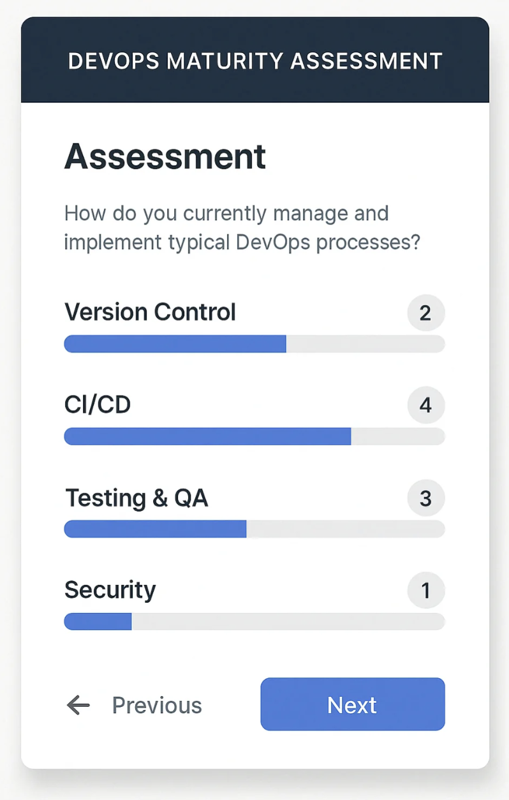

# 🚀 DevOps Maturity Assessment Tool

[](LICENSE)
[](https://github.com/murleedas/devops-maturity-tool/issues)
[](https://murleedas.github.io/devops-maturity-tool)

<div align="center">
  
  <p><em>Sample Assessment Interface</em></p>
</div>

## 📋 Table of Contents
- [Features](#-features)
- [How It Works](#-how-it-works)
- [Installation](#-installation)
- [Usage Guide](#-usage-guide)
- [Customization](#-customization)
- [Contributing](#-contributing)
- [Acknowledgements](#-acknowledgements)

## ✨ Features
**Comprehensive DevOps Evaluation**
- 10 critical questions across 6 domains
- Real-time progress tracking
- Automated maturity scoring (0-4 levels)
- Domain-specific weightings (CI/CD, Security, etc.)

**Actionable Insights**
- Instant PDF report generation
- Level-specific recommendations
- Strength identification
- Continuous improvement roadmap

**Technical Highlights**
- Mobile-responsive design
- Modern UI with animations
- Zero backend dependencies
- Local storage support
- Automated CI/CD ready

## 🛠️ How It Works
1. **Assessment Phase**  
   Users complete a 10-question survey about their DevOps practices

2. **Analysis Engine**  
   - Calculates weighted scores across domains
   - Determines maturity level (0-4)
   - Identifies strengths/improvement areas

3. **Reporting**  
   - Generates PDF with visual scorecard
   - Provides tailored recommendations
   - Offers comparison with industry benchmarks

## ⚙️ Installation

### Quick Start (GitHub Pages)
1. Fork this repository
2. Go to Settings → Pages
3. Set source branch to `main`
4. Set folder to `/(root)`
5. Access at: `https://murleedas.github.io/devops-maturity-tool`

### Local Development
```bash
# Clone repository
git clone https://github.com/murleedas/devops-maturity-tool.git
cd devops-maturity-tool

# Install dependencies
npm install

# Start development server
npm run dev

# Build for production
npm run build

```

## 📖 Usage Guide
**For Assessors**
1. Answer all questions honestly

2. Review generated maturity level

3. Download PDF report

4. Share results with team

5. Implement recommendations

**For Developers**
```bash
# File Structure
src/
├── css/           # Style sheets
├── js/            # Core logic
├── index.html     # Main interface
public/            # Assets & build files

# Key Configuration Files
- script.js        # Scoring logic & PDF generation
- style.css        # Visual styling
- index.html       # Question structure
```

## Customization
**Modify Questions**
Edit src/index.html:
```html
<!-- Add new question -->
<div class="question-card">
  <label>11. How is documentation managed?</label>
  <select class="mandatory" data-domain="culture">
    <option value="" disabled selected>Select option</option>
    <option value="0">No centralized docs</option>
    <option value="2">Basic Confluence/Wiki</option>
    <option value="4">Automated docs with Swagger</option>
  </select>
</div>
```
**Adjust Scoring Logic**
Edit src/js/script.js:
```javascript
// Change domain weights
const DOMAIN_WEIGHTS = {
  'ci-cd': 0.30,  // Increased importance
  'iac': 0.15,
  // ... keep others ...
};

// Modify level thresholds
const MATURITY_LEVELS = [
  { threshold: 25 }, // Level 0 now starts at 25%
  // ... adjust other levels ...
];
```
**Update Styling**
Edit src/css/style.css:
```css
/* Change primary color */
:root {
  --primary-color: #3B82F6; /* New blue shade */
}

/* Modify progress bar */
#progress-bar {
  height: 15px;
  border-radius: 8px;
  background: linear-gradient(90deg, var(--primary-color), #60A5FA);
}
```
## 🤝 Contributing
1. Fork the repository
2. Create feature branch
3. Commit changes
4. Push to branch
5. Open Pull Request

**Code Standards**
- Follow existing formatting
- Add comments for complex logic
- Test changes locally

## 🌟 Acknowledgements
- Built with [jspdf](jsPDF)
- Inspired by DORA metrics
- UI components from Open Props

**Created by Murali Doss** - 📧 [muralidoss-email](muralidoss@outlook.com)
**Live Demo:** [demo-link](https://murleedas.github.io/devops-maturity-tool/)

**⚠️ Note: Results should be validated with engineering teams**

